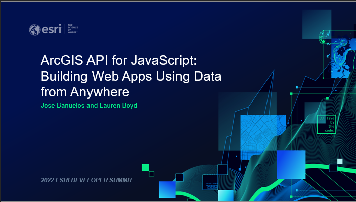

# Esri Developer Summit Presentations
This repository contains all the resources used for Esri Developer Summit presentations that I have authored and coauthored.

## 2022
### ArcGIS API for JavaScript: Programming Patterns and API Fundamentals
_CoAuthored with Hugo Campos and [Rene Rubalcava](https://github.com/odoe)_

In this session, you'll learn the basics of the ArcGIS API for JavaScript, including the fundamentals of watching for property changes, autocasting, working with collections, and lazy-loading data in your applications. You'll learn more details about maps, webmaps, layers, 2D and 3D views, UI, and widgets. This is a key session for developers new to the 4.x version of the API.

### ArcGIS API for JavaScript: Building Web Apps Using Data from Anywhere
_CoAuthored with [Jose Banuelos](https://github.com/banuelosj)_

GeoJSON, CSV, and OGC data can easily be brought in as layers with the ArcGIS API for JavaScript. In this demo theater, we will build an application that will take advantage of the many capabilities of these layer types.